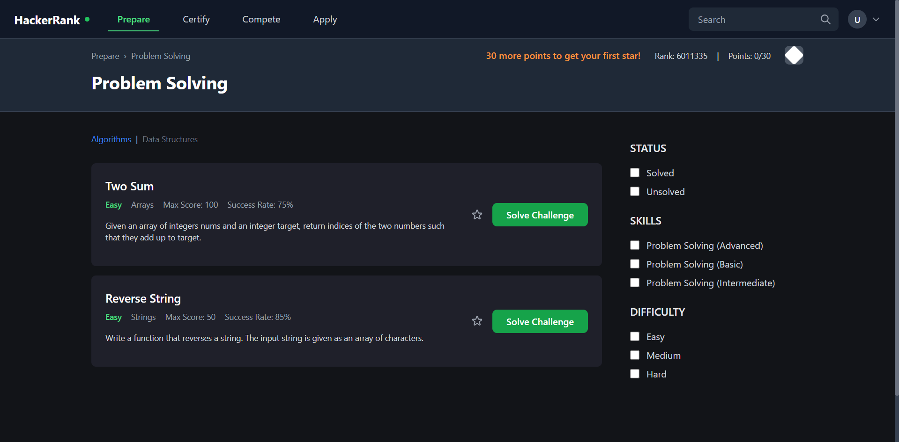
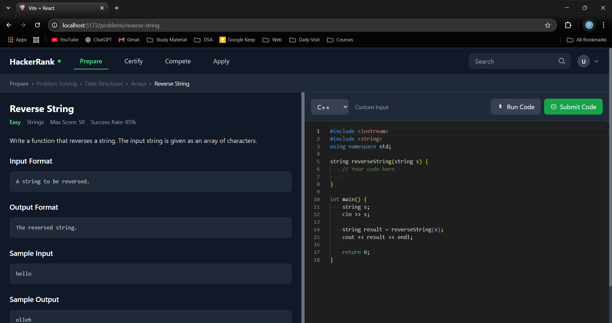
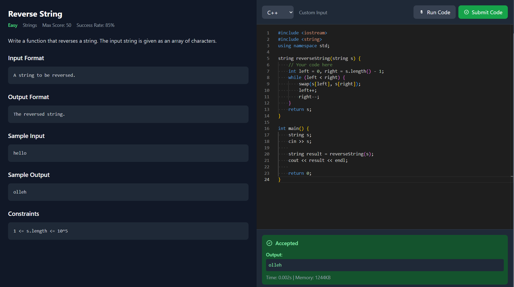
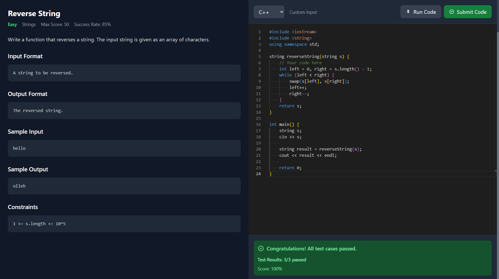

# CodingPlatform

## 🎯 Project Overview

CodingPlatform is a web-based coding challenge platform that allows users to solve DSA problems and execute their code in real-time. The platform runs user-submitted code against hardcoded test cases and provides immediate feedback on correctness.

## 📷 Screenshots

### Problem List Page

*Browse through available DSA problems with clean card-based layout*

### Problem Solving Interface

*Interactive code editor with problem description and real-time execution*

### Code Execution Results

*Real-time code execution with test case validation and output display*

### Code Submission Results

*Real-time code submission with test case validation and output display*

## ✨ Features

- **Problem Browser**: View a list of available DSA problems
- **Code Editor**: Interactive code editor for writing solutions
- **Real-time Execution**: Execute code and view output instantly
- **Test Case Validation**: Automatic testing against predefined test cases
- **Clean UI**: Modern, responsive design built with Tailwind CSS
- **Problem Navigation**: Seamless navigation between problem list and individual problems

## 🛠️ Tech Stack

- **Frontend**: React.js
- **Styling**: Tailwind CSS
- **Code Execution**: Judge0 API integration
- **Build Tool**: Create React App (assumed)

## 📁 Project Structure

```
src/
├── components/
│   ├── CodeEditor.jsx      # Interactive code editor component
│   ├── Header.jsx          # Navigation header component
│   ├── ProblemCard.jsx     # Problem display card component
│   └── Sidebar.jsx         # Sidebar navigation component
├── data/
│   └── problems.js         # Static problem data and test cases
├── hooks/
│   └── useCodeExecution.js # Custom hook for code execution logic
├── pages/
│   ├── ProblemList.jsx     # Problems listing page
│   └── ProblemPage.jsx     # Individual problem solving page
└── services/
    └── judge0Service.js    # Judge0 API integration service
```

## 🚀 Getting Started

### Prerequisites

- Node.js (v14 or higher)
- npm or yarn package manager

### Installation

1. Clone the repository:
```bash
git clone https://github.com/yourusername/CodingPlatform.git
cd CodingPlatform
```

2. Install dependencies:
```bash
npm install
# or
yarn install
```

3. Start the development server:
```bash
npm start
# or
yarn start
```

4. Open your browser and navigate to `http://localhost:3000`

## 🔧 Configuration

### Judge0 API Setup

The project uses Judge0 API for code execution. Make sure to:

1. Configure your Judge0 API endpoint in `services/judge0Service.js`
2. Set up proper API keys if required
3. Ensure CORS is properly configured for your domain

## 📋 Current Implementation

### Completed Features

- ✅ Problem listing page with problem cards
- ✅ Individual problem page with code editor
- ✅ Code execution with real-time output
- ✅ Test case validation against hardcoded cases
- ✅ Responsive UI with Tailwind CSS
- ✅ Navigation between pages


---

**Note**: This is a proof-of-concept implementation focusing on core functionality. The platform demonstrates the fundamental features of a coding challenge website with emphasis on code execution and problem solving workflow.
